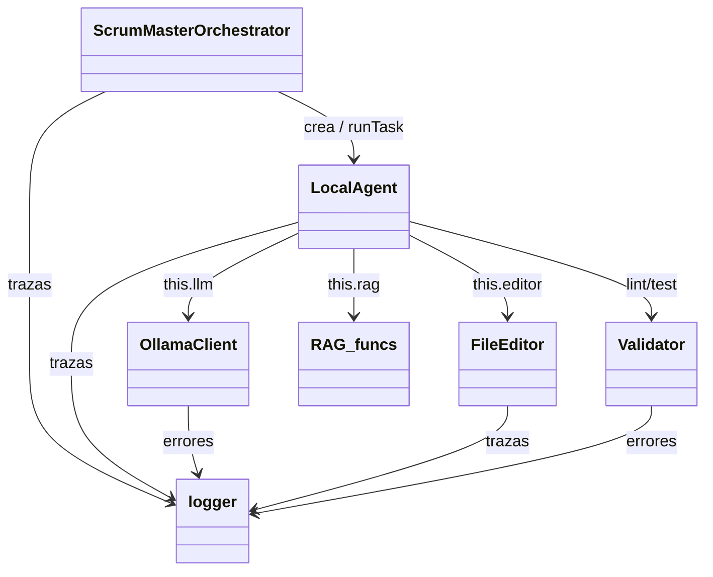

# ClassGraph

Índice del módulo `src/`. Esta nota **no enlaza** a propósito: cita las clases
en código para no aparecer como nodo en la vista de grafo de Obsidian
(el grafo de Obsidian solo usa wikilinks reales, y aquí no hay ninguno).

## Notas (un fichero por clase)

- `orchestrator` — `ScrumMasterOrchestrator`, raíz, crea agentes por rol (`orchestrator.md`)
- `local_agent` — `LocalAgent`, usa LLM + RAG + ficheros (`local_agent.md`)
- `ollama` — `OllamaClient`, cliente HTTP del LLM (`ollama.md`)
- `editor` — `FileEditor`, lectura/escritura de ficheros (`editor.md`)
- `validator` — `Validator`, lint / sintaxis / tests (`validator.md`)
- `ragi` — `cosineSimilarity`; clase `RAG` pendiente (`ragi.md`)
- `logger` — logging central, hoja usada por todos (`logger.md`)

## Pendiente de analizar (no crear de golpe)

> FASE 5: `src/` eliminado (ver [[legacy-src]]). La arquitectura viva está en
> [[MOC-arquitectura]]: `orchestrator/`, `agents/`, `llm/`, `server/`, `utils/`.

- `prompts/index.js` — personas por rol (nota pendiente; fuente migrada a `agents/personas.js`, ver [[personas]])
- `server.js`, `orchestrator.js` (raíz) — entrypoints (partido en `server/` + shim en FASE 5; notas pendientes)
- `lib/*.js` — `deliverable`, `default-team`, `openai-compatible-llm`, `local-llm`, `rag`, `cursor-cloud-llm`, `llm-auth-hints`, `llm-connection-info`, `llm-provider-presets`, `flow-mermaid`, etc. (notas pendientes, una por clase según se descubran)
